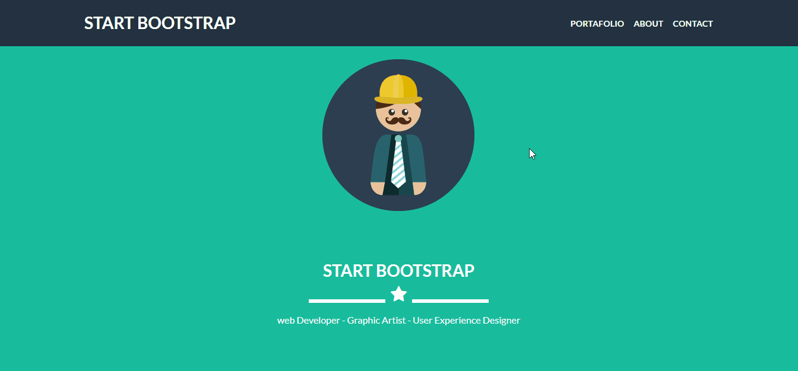
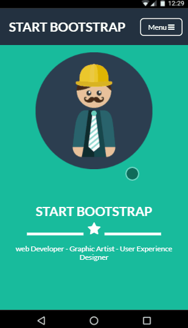
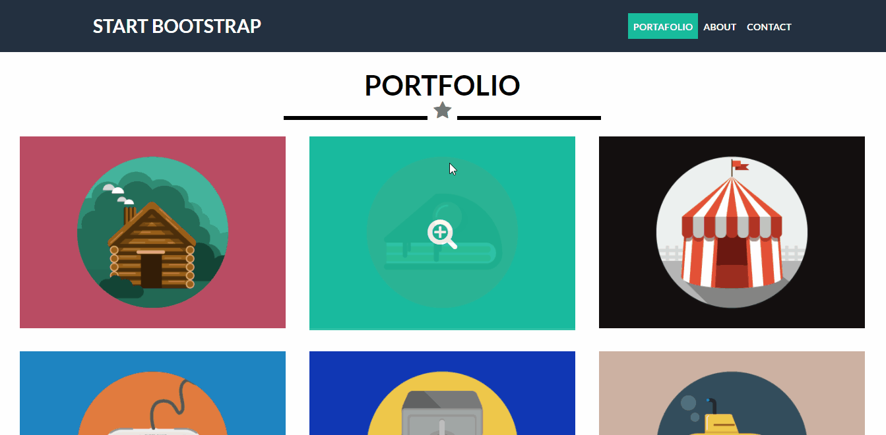
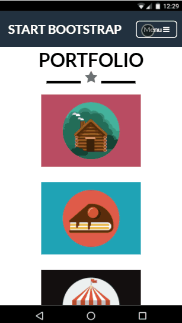
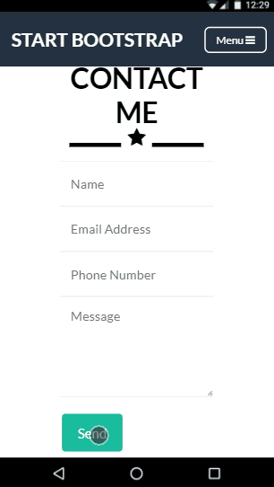

# Freelancer

Freelancer es un tema de Bootstrap.    
+ En ésta réplica el diseño se realiza con **flex-box**
+ Diseño responsive

---
### Efecto scroll
+ Al bajar el scroll la barra de navegación es fija
+ Al bajar por cada sección cambia de color el item de la navegación que le corresponde
+ Al hacer click en cada uno de los item te dirige a  cada una de las secciones respectivamente

##### _Desktop_
>

##### _Mobile_
>

----
### Portafolio
+ Uso grid para las imágenes
+ Al hacer **hover** en las imágenes cambia el color de fondo
+ Al hacer **click** aparece un modal con la imágen y descripción del proyecto
+ Cada uno de los **modal** esta **creado dinámicamente** con **javascript**
    * **Javascript**
 ```
var imageToShowModal = document.getElementsByClassName("image-to-show-modal");
var modalContainer = document.getElementById("modal-container");
var modalImage = document.getElementById("image-modal");
var modalDescr = document.getElementById("proyect-description");
for (var i = 0; i < imageToShowModal.length; i++){
    imageToShowModal[i].addEventListener("click", function(event){
        modalContainer.style.display = "block";
        modalContainer.style.opacity = 1;
        modalImage.src = event.currentTarget.nextElementSibling .src;
    });
}
```

##### _Desktop_
>

##### _Mobile_
>

---
### Contacto
+ validación de formulario mediante HTML y javascript
    * Al empezar a escribir aparece el **label** y si el campo está vacío desaparece
    * Al hacer click en botón   el mensaje de error
    * El input de **nombre** sólo acepta **letras**
    * El input de **teléfono** sólo acepta números y está validaddo con regExp
    

##### _Desktop_
>

##### _Mobile_
>    

---
### Demo
[Frelancer | flexbox](https://ely405.github.io/start-boostrap/?target=_blank)


